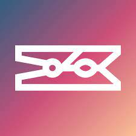

# Hi, I'm Luka👋

[](https://www.linkedin.com/in/luka-momcilovic-2102b4226/)

[](https://www.codewars.com/users/lukamo)

My name is Luka Momcilovic and I'm a [Computer Science](https://www.uio.no/studier/program/informatikk-programmering/) student at University of Oslo's [Department of Informatics](https://www.mn.uio.no/ifi/english/). <br>
Before starting my CS studies I received a Bachelor's Degree in [Medical Laboratory Science](https://www.oslomet.no/studier/hv/bioingenioer) at Oslomet - Metropolitan University.

- I’m currently working on a dating app
- I’m currently learning MySQL, Ionic and certain AWS-services
- Hobbies: 🎾 & 🏋️

---

#### 📊 This Week I Spent My Time On:
<!--START_SECTION:waka-->

```text
TypeScript   1 hr 53 mins    ██████████████████████▒░░   89.97 %
Bash         8 mins          █▓░░░░░░░░░░░░░░░░░░░░░░░   06.81 %
JavaScript   2 mins          ▓░░░░░░░░░░░░░░░░░░░░░░░░   02.10 %
JSON         1 min           ▒░░░░░░░░░░░░░░░░░░░░░░░░   00.84 %
Vue.js       0 secs          ░░░░░░░░░░░░░░░░░░░░░░░░░   00.15 %
SCSS         0 secs          ░░░░░░░░░░░░░░░░░░░░░░░░░   00.14 %
```

<!--END_SECTION:waka-->
---

📈 **My GitHub Stats:**
<p>
  
  
</p>

---

### Languages


<br>

### Frameworks


<br>

### Tools




<br>
